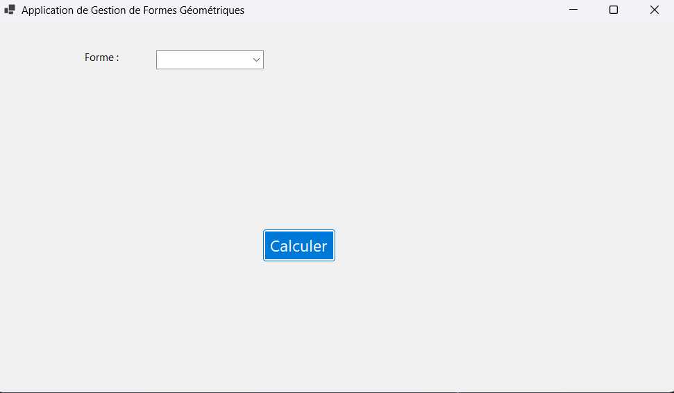
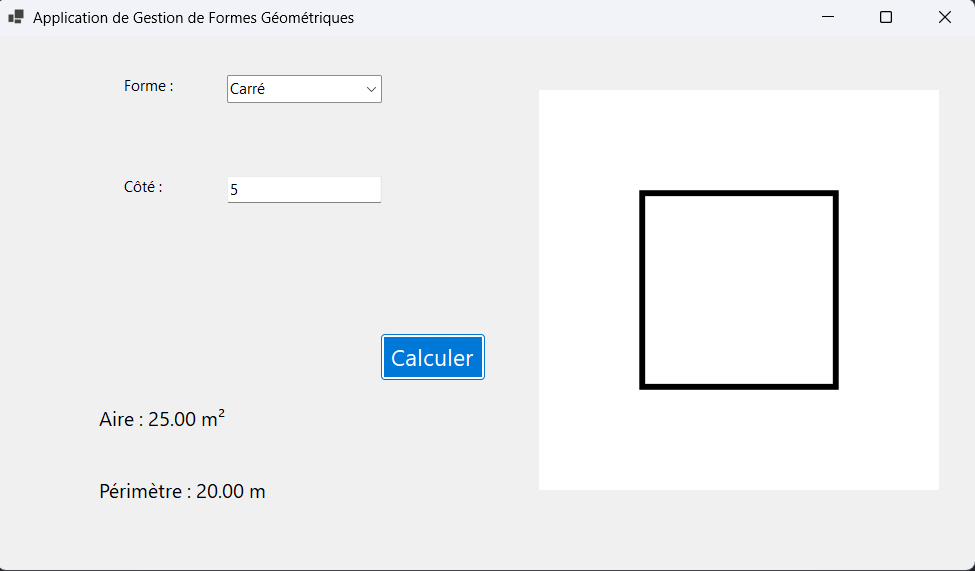
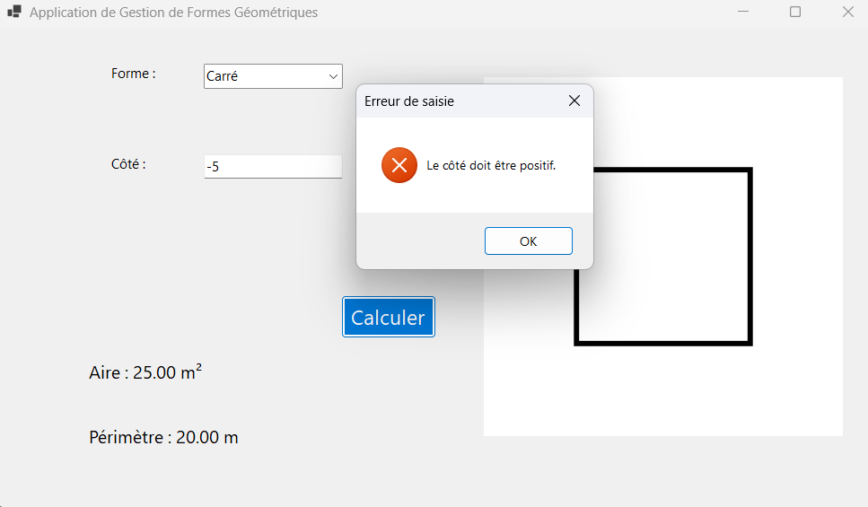
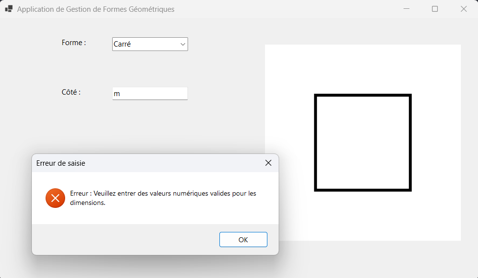
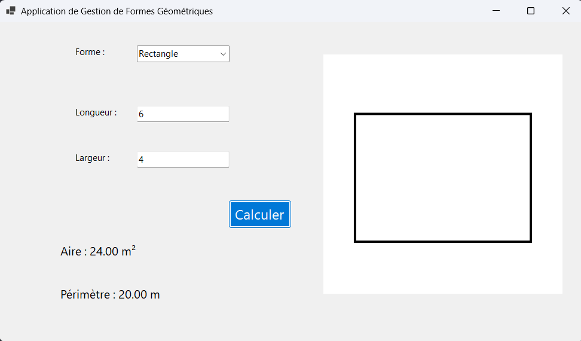
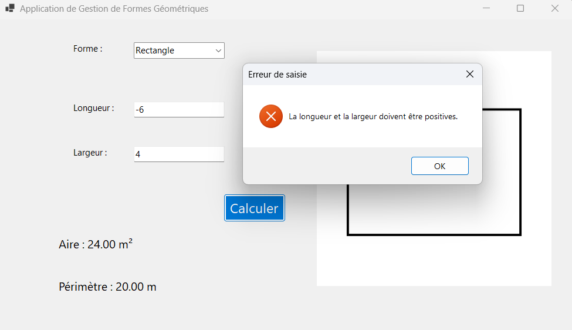
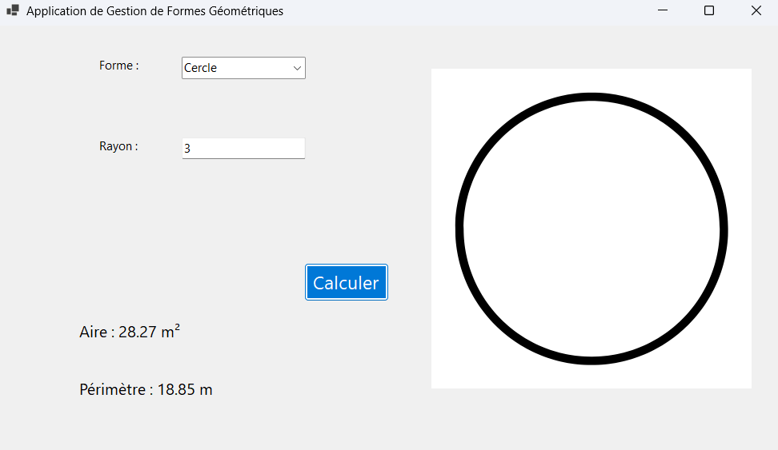
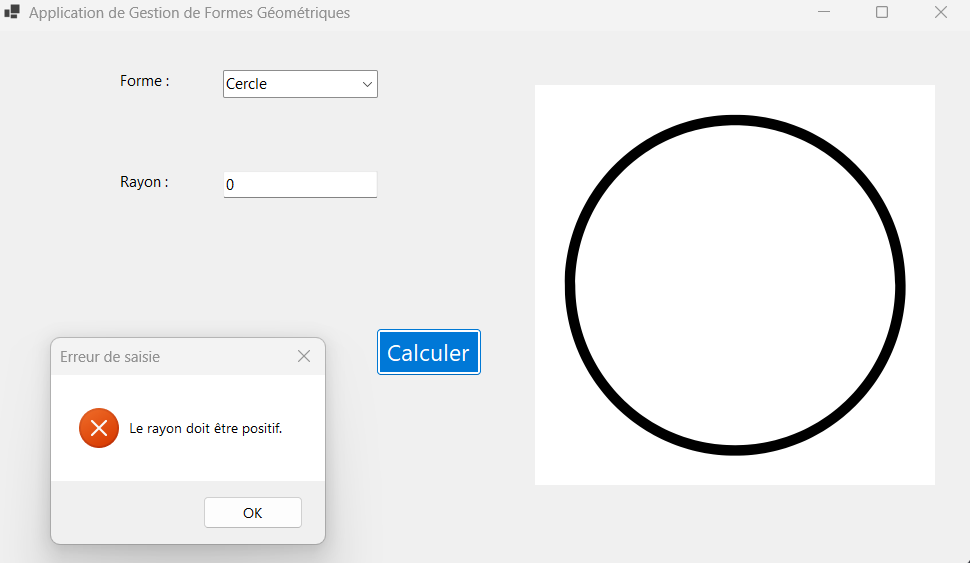
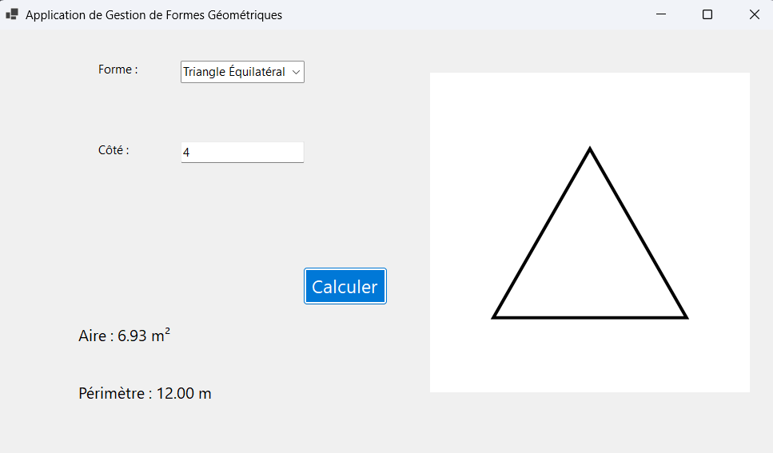
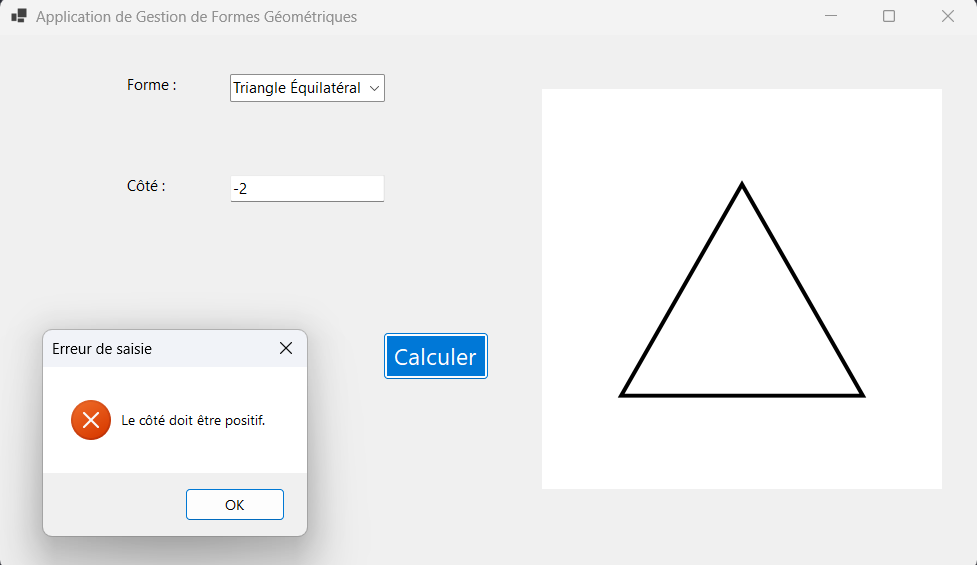

# 📐 Calculateur de Formes Géométriques

🎯 Application Windows Forms pour calculer l'aire et le périmètre de différentes formes géométriques.

## 📑 Table des Matières

- **📝 Description**  
- **✨ Fonctionnalités**
- **🧪 Tests Effectués**

## 📝 Description

Cette application Windows Forms illustre les concepts de la Programmation Orientée Objet (POO) en permettant aux utilisateurs de calculer l'aire et le périmètre de différentes formes géométriques.

## ✨ Fonctionnalités

- 📋 Sélection de formes géométriques via une liste déroulante
- 🧮 Calcul de l'aire et du périmètre pour :
  1. ⬛ Carré
  2. 🟥 Rectangle
  3. ⭕ Cercle
  4. 🔺 Triangle Équilatéral
- 🎨 Affichage visuel des formes
- ✅ Validation des entrées utilisateur
- ⚠️ Gestion des erreurs

## 🧪 Tests Effectués

### 1. 🔄 Test de Sélection des Formes

- **Sélection initiale (aucune forme)**
  - 🔍 Vérification : Message "Veuillez sélectionner une forme"
  - ✅ Résultat attendu : Les champs de saisie restent masqués
  - **Test effectué** : Lancement de l'application sans sélection
  - **Résultat obtenu** : Message d'avertissement affiché

  

### 2. ⬛ Test du Carré

  
  - **Test effectué** : Calcul de l'aire et du périmètre d'un carré
  - **Valeurs entrées** : Côté = 5
  - **Résultat obtenu** : Aire = 25,00 m², Périmètre = 20,00 m
  - **Statut** : ✅ Succès

  
  - **Test effectué** : Validation des erreurs
  - **Valeurs entrées** : Côté = -5
  - **Résultat obtenu** : Message "Le côté doit être positif"
  - **Statut** : ✅ Succès

  
  - **Test effectué** : Validation des erreurs
  - **Valeurs entrées** : Côté = "m"
  - **Résultat obtenu** : Message "Erreur : Veuillez entrer des valeurs numériques valides pour les dimensions"
  - **Statut** : ✅ Succès

### 3. 🟥 Test du Rectangle

  
  - **Test effectué** : Calcul de l'aire et du périmètre d'un rectangle
  - **Valeurs entrées** : Longueur = 6, Largeur = 4
  - **Résultat obtenu** : Aire = 24,00 m², Périmètre = 20,00 m
  - **Statut** : ✅ Succès

  
  - **Test effectué** : Validation des erreurs
  - **Valeurs entrées** : Largeur = -6
  - **Résultat obtenu** : Message "La longueur et la largeur doivent être positives."
  - **Statut** : ✅ Succès

### 4. ⭕ Test du Cercle

  
  - **Test effectué** : Calcul de l'aire et du périmètre d'un cercle
  - **Valeurs entrées** : Rayon = 3
  - **Résultat obtenu** : Aire ≈ 28,27 m², Périmètre ≈ 18,85 m
  - **Statut** : ✅ Succès

  
  - **Test effectué** : Validation des erreurs
  - **Valeurs entrées** : Rayon = 0
  - **Résultat obtenu** : Message "Le rayon doit être positif"
  - **Statut** : ✅ Succès

### 5. 🔺 Test du Triangle Équilatéral

  
  - **Test effectué** : Calcul de l'aire et du périmètre d'un triangle équilatéral
  - **Valeurs entrées** : Côté = 4
  - **Résultat obtenu** : Aire ≈ 6,93 m², Périmètre = 12,00 m
  - **Statut** : ✅ Succès

  
  - **Test effectué** : Validation des erreurs
  - **Valeurs entrées** : Côté = -2
  - **Résultat obtenu** : Message "Le côté doit être positif"
  - **Statut** : ✅ Succès

